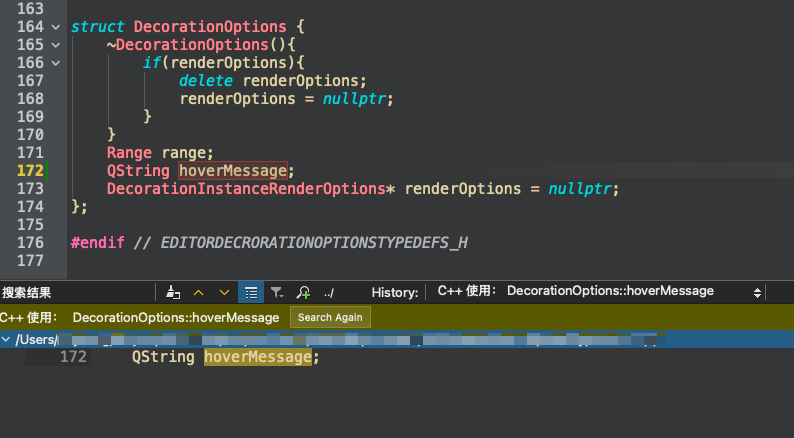

## C++ 删除一个类或者结构体的属性时，千万不要相信对这个属性的查找引用

### 问题

对属性查找引用时，没有查到到任何引用，如果删除了这个属性，在编译时，却报错了



因为C++支持初始化列表，所以可以在初始化列表中，给属性赋值


以上能报错还算好，下面这种都不会报错，属于<font style="color:red; font-weight:bold;">巨坑</font>

```cpp

struct A
{
    int a;
    int b;
    int c;
};

A a = {1, 2};

```

此时如果删除了属性b，赋值的位置，2会被赋值给c，并不会报错，但是代码的意思已经改变了，如果没有注意，就会导致bug，还不容易发现

### 建议

以上述代码为例，如果要删除属性b，应该先对A进行查找引用，找到A所有用到的地方，再检查是否有用到b的地方