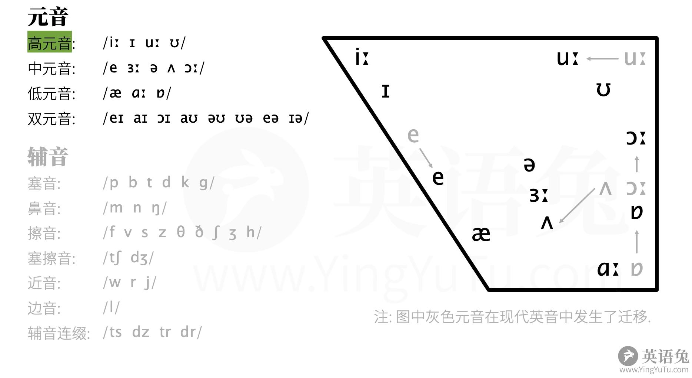

# 音标

英语兔

[全网最适合中国人的免费音标课(纯干货, 超详细!)](https://www.bilibili.com/video/BV1iV411z7Nj/?share_source=copy_web)

## 国际音标

## dj音标

|元音		|辅音					|
|-			|-						|
| /i:/	|	/p/  /b/			|
| /ɪ/		|	/t/  /d/			|
| /u:/	|	/k/  /g/			|
| /ʊ/		|	/m/  /n/  /ŋ/	|
| /e/		|	/f/  /v/			|
| /ɜ:/	|	/s/  /z/			|
| /ə/		|	/θ/  /ð/			|
| /ʌ/		|	/ʃ/  /ʒ/		   |
| /ɔ:/	|	/h/				|
| /æ/		|	/tʃ/ /dʒ/		|
| /ɑ:/	|	/w/				|
| /ɒ/		|	/r/				|
| /eɪ/	|	/j/				|
| /aɪ/	|	/l/				|
| /ɔɪ/	|	/ts/ /dz/		|
| /aʊ/	|	/tr/ /dr/		|
| /əʊ/	|						|
| /ʊə/	|						|
| /eə/	|						|
| /ɪə/	|						|

### 音标图

## kk音标

## 元音

### 元音三要素

1. 圆唇度
2. 舌位高低
3. 舌位前后

## 辅音

### 辅音三要素

1. 清浊
2. 调音部位
3. 调音方式

### the

the在元音前读[ði],在辅音前读[ðə]