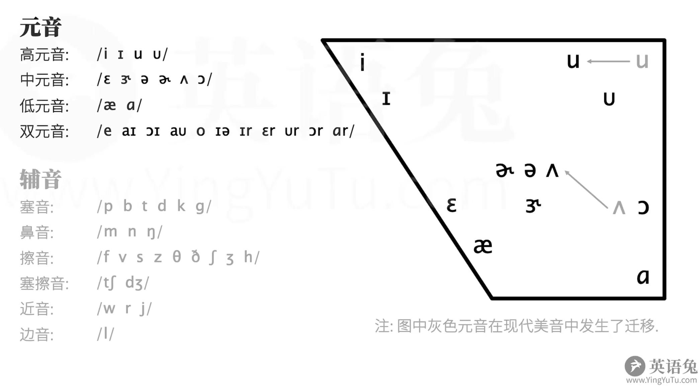

# 音标

英语兔

[全网最适合中国人的免费音标课(纯干货, 超详细!)](https://www.bilibili.com/video/BV1iV411z7Nj/?share_source=copy_web)

## 国际音标

...

## DJ音标

分为旧版（IPA63）和新版（IPA88）

|元音	|辅音				|
|-		|-					|
| /i:/	|	/p/  /b/		|
| /ɪ/	|	/t/  /d/		|
| /u:/	|	/k/  /g/		|
| /ʊ/	|	/m/  /n/  /ŋ/	|
| /e/	|	/f/  /v/		|
| /ɜ:/	|	/s/  /z/		|
| /ə/	|	/θ/  /ð/		|
| /ʌ/	|	/ʃ/  /ʒ/		|
| /ɔ:/	|	/h/				|
| /æ/	|	/tʃ/ /dʒ/		|
| /ɑ:/	|	/w/				|
| /ɒ/	|	/r/				|
| /eɪ/	|	/j/				|
| /aɪ/	|	/l/				|
| /ɔɪ/	|	/ts/ /dz/		|
| /aʊ/	|	/tr/ /dr/		|
| /əʊ/	|					|
| /ʊə/	|					|
| /eə/	|					|
| /ɪə/	|					|

### 音标图

## KK音标
|元音		|辅音	|
|-			|-		|
|/i/		|		|
|/ɪ/		|		|
|/ɛ/		|		|
|/æ/		|		|
|/ɑ/		|		|
|/ɔ/		|		|
|/u/		|		|
|/ʊ/		|		|
|/Λ/		|		|
|/ə/		|		|
|/ɚ/=/ɝ/	|		|
|/e/		|		|
|/o/		|		|
|/aɪ/		|		|
|/ɔɪ/		|		|
|/ɑr/		|		|
|/aʊ/		|		|
|/ɔr/		|		|
|/ɪə/		|		|
|/iə/		|		|
|/ʊr/		|		|
|/ɪr/		|		|
|/ɛr/		|		|

### 音标图

## 元音

### 元音三要素

1. 圆唇度
2. 舌位高低
3. 舌位前后

### 高元音

#### /i:/

- 发音和`币`的拼音`bì`的韵母基本一致
- 后面看似是冒号的符号是上下两个对立的三角形，是长音符号，起廷音作用
- 对应kk音标`/i/`，kk音标没有长音符号，元音时长视具体单词情况而定
- `/i/`也是`/i:/`的一种短版本，比如`happy /'hæpi:/`通常读做`/'hæpi/`，不会拖长音读，这种现象称为：`happy紧化`，再比如`he /hi:/`、`she /ʃi:/`等的`弱读（week）`形式是`/hi/`、`/ʃi/`

*示例*

|单词	|音标	|常见错误读音	|
|-		|-		|-			|
|bee	|/bi:/	|贝			|
|fee	|/fi:/	|费			|
|pea	|/pi:/	|配			|
|read	|/ri:d/	|瑞的		|
|meat	|/mi:t/	|妹特		|
|lead	|/li:d/	|累的		|

#### /ɪ/

- 发音比`/i:/`的舌位稍低（口腔稍稍张大一丢丢），无需圆唇，从`/i:/`到`/i/`嘴巴有种笑容逐渐消失和感觉
- 中文拼音中没有这个音
- 对应kk音标`/ɪ/`，发音一致

*示例*

|单词	|音标	|常见错误读音			|
|-		|-		|-					|
|bit	|/bɪt/	|比特、bet、贝特		|
|fit	|/fɪt/	|f衣特	、fet、菲特	|
|pit	|/pɪt/	|屁特、pet、配特		|
|lit	|/lɪt/	|立特、let、雷特		|
|hit	|/hɪt/	|h衣特、het、嘿特		|
|fish	|/fɪʃ/	|f衣是、fesh、费事	|

#### /u:/

- 发音和`姑`的拼音`gū`的韵母基本一致，但拼音的`ū`更加圆唇
- 现代英语中发音在音标图中向前移，导致更加扁唇
- 对应kk音标`/u/`，kk音标没有长音符号，元音时长视具体单词情况而定
- kk音标中有个`/U/`，与之对应的dj音标不是`/u:/`，而是`/ʊ/`
- `/u:/`也有一个短版本`/u/`，比如：`influence /'ɪnfluəs/`,再比如`you /ju:/;/jə/`的弱读`/ju/`

*示例*

|单词	|音标		|常见错误读音	|
|-		|-			|-			|
|too	|/tu:/		|兔			|
|food	|/fu:d/		|富的		|
|loose	|/lu:s/		|路斯		|
|music	|/'mju:zɪk/	|木贼克		|
|news	|/nju:z/	|纽斯		|
|student|/'stju:dnt/|斯丢等特		|

#### /ʊ/

- 俗称马蹄u
- 在老版dj音标中写作`/u/`
- 发音时只需微微圆唇，比`/ʊ/`发音时稍稍放松
- 普通话中没有这个音
- 对应kk音标`/U/`

*示例*

|单词	|音标	|常见错误读音	|
|-		|-		|-			|
|book	|/bʊk/	|不可		|
|look	|/lʊk/	|录可		|
|good	|/gʊd/	|顾的		|
|took	|/tʊk/	|兔可		|
|bush	|/bʊʃ/	|布什		|
|would	|/wʊd/	|屋的		|

### 中元音

#### /e/

- 发音和`也`的拼音`yě`的韵母基本一致
- 对应kk音标中的`/ɛ/`,而kk音标中的`/e/`是个又元音，对应dj音标中的`/eɪ/`

*示例*

|单词	|音标	|常见错误读音	|
|-		|-		|-			|
|bed	|/bed/	|拜的		|
|get	|/get/	|盖特		|
|pet	|/pet/	|派特		|
|let	|/let/	|赖特		|
|met	|/met/	|卖特		|
|set	|/set/	|塞特		|

#### /ɜ:/

- 在老版中写作`/ə:/`
- 这个音后面一般接字母`r`,在美音中会变成`R化元音`
- 对应kk音标中的`/ɝ/`
- 用dj音标给美音注意使用`/ɜ:r/`

*示例*

|单词	|音标		|dj音标美音注音	|kk音标美音注音	|
|-		|-			|-				|-				|
|her	|/hɜ:/		|/hɜ:r/			|/hɝ/			|
|person	|/'pɜ:sn/	|/'pɜ:rsn/		|/'pɝsn/		|
|learn	|/lɜ:n/		|/lɜ:rn/		|/lɝn/			|
|bird	|/bɜ:d/		|/bɜ:rd/		|/bɝd/			|
|word	|/wɜ:d/		|/wɜ:rd/		|/wɝd/			|
|fur	|/fɜ:/		|/fɜ:r/			|/fɝ/			|

#### /ə/

*示例*

|单词	|音标	|常见错误读音	|
|-		|-		|-			|
|		|		|			|
|		|		|			|
|		|		|			|
|		|		|			|
|		|		|			|
|		|		|			|

#### /ʌ/

*示例*

|单词	|音标	|常见错误读音	|
|-		|-		|-			|
|		|		|			|
|		|		|			|
|		|		|			|
|		|		|			|
|		|		|			|
|		|		|			|

#### /ɔ:/

*示例*

|单词	|音标	|常见错误读音	|
|-		|-		|-			|
|		|		|			|
|		|		|			|
|		|		|			|
|		|		|			|
|		|		|			|
|		|		|			|

### 低元音

#### /æ/

*示例*

|单词	|音标	|常见错误读音	|
|-		|-		|-			|
|		|		|			|
|		|		|			|
|		|		|			|
|		|		|			|
|		|		|			|
|		|		|			|

#### /ɑ:/

*示例*

|单词	|音标	|常见错误读音	|
|-		|-		|-			|
|		|		|			|
|		|		|			|
|		|		|			|
|		|		|			|
|		|		|			|
|		|		|			|

#### /ɒ/

*示例*

|单词	|音标	|常见错误读音	|
|-		|-		|-			|
|		|		|			|
|		|		|			|
|		|		|			|
|		|		|			|
|		|		|			|
|		|		|			|

### 双元音

#### /eɪ/

*示例*

|单词	|音标	|常见错误读音	|
|-		|-		|-			|
|		|		|			|
|		|		|			|
|		|		|			|
|		|		|			|
|		|		|			|
|		|		|			|

#### /aɪ/

*示例*

|单词	|音标	|常见错误读音	|
|-		|-		|-			|
|		|		|			|
|		|		|			|
|		|		|			|
|		|		|			|
|		|		|			|
|		|		|			|

#### /ɔɪ/

*示例*

|单词	|音标	|常见错误读音	|
|-		|-		|-			|
|		|		|			|
|		|		|			|
|		|		|			|
|		|		|			|
|		|		|			|
|		|		|			|

#### /aʊ/

*示例*

|单词	|音标	|常见错误读音	|
|-		|-		|-			|
|		|		|			|
|		|		|			|
|		|		|			|
|		|		|			|
|		|		|			|
|		|		|			|

#### /əʊ/

*示例*

|单词	|音标	|常见错误读音	|
|-		|-		|-			|
|		|		|			|
|		|		|			|
|		|		|			|
|		|		|			|
|		|		|			|
|		|		|			|

#### /ʊə/

*示例*

|单词	|音标	|常见错误读音	|
|-		|-		|-			|
|		|		|			|
|		|		|			|
|		|		|			|
|		|		|			|
|		|		|			|
|		|		|			|

#### /eə/

*示例*

|单词	|音标	|常见错误读音	|
|-		|-		|-			|
|		|		|			|
|		|		|			|
|		|		|			|
|		|		|			|
|		|		|			|
|		|		|			|

#### /ɪə/

*示例*

|单词	|音标	|常见错误读音	|
|-		|-		|-			|
|		|		|			|
|		|		|			|
|		|		|			|
|		|		|			|
|		|		|			|
|		|		|			|

## 辅音

### 辅音三要素

1. 清浊
2. 调音部位
3. 调音方式

### 其它

#### the

the在元音前读[ði],在辅音前读[ðə]
 
---
 
[拼音辅助](https://hanzi.unihan.com.cn/PinYin?id=bi4)