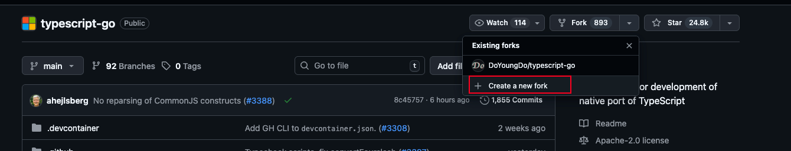
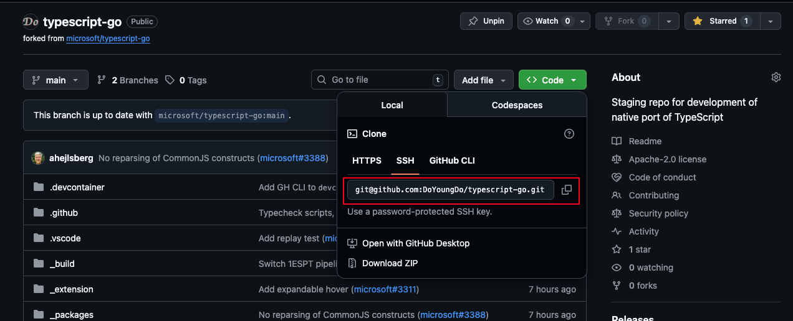
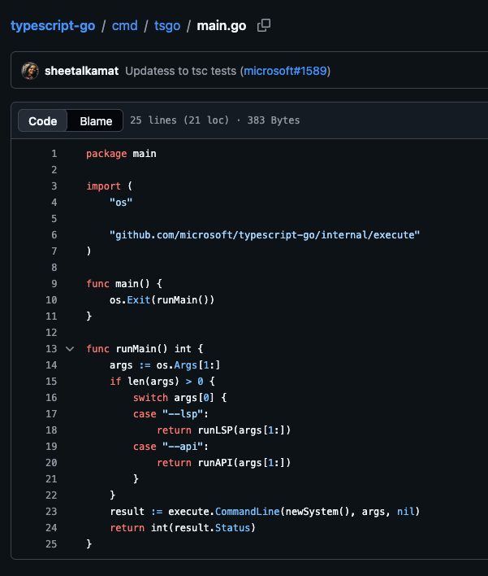

*2026-04-14*

## 《typescript-go》二次开发-源码编译运行

> 仓库地址：[typescript-go](https://github.com/microsoft/typescript-go)

### fork

先fork仓库，然后在fork的仓库中进行开发。



### clone

clone 仓库到本地



```bash
git clone git@github.com:DoYoungDo/typescript-go.git
```

### 安装go

*注意：tsgo 需要go1.26版本以上*

[https://golang.google.cn/dl](https://golang.google.cn/dl/)

### 下载安装依赖

*到项目目录后执行命令会自动处理依赖*

```bash
cd typescript-go
go mod tidy
```

### 编译

```bash
go build -o /xxx/tsgo ./cmd/tsgo

```

*编译带调试信息的tsgo*

```bash
go build -gcflags="all=-N -l" -ldflags="-compressdwarf=false" -v -o /xxx/tsgo ./cmd/tsgo 
```

### 运行

#### 主入口

从程序入口可以看到，tsgo程序启动时可以指定lsp启动可api启动，这时tsgo会作为一个服务在后台运行



#### lsp启动

`--lsp` 启动lsp服务

`--pprofDir ./` 设置日志文件存储的位置

`--stdio` 设置通信方式，支持传 `stdio`、`pipe`、`socket`，截止目前仅支持 `stdio` 方式

```bash
tsgo --lsp --pprofDir ./ --stdio 
```