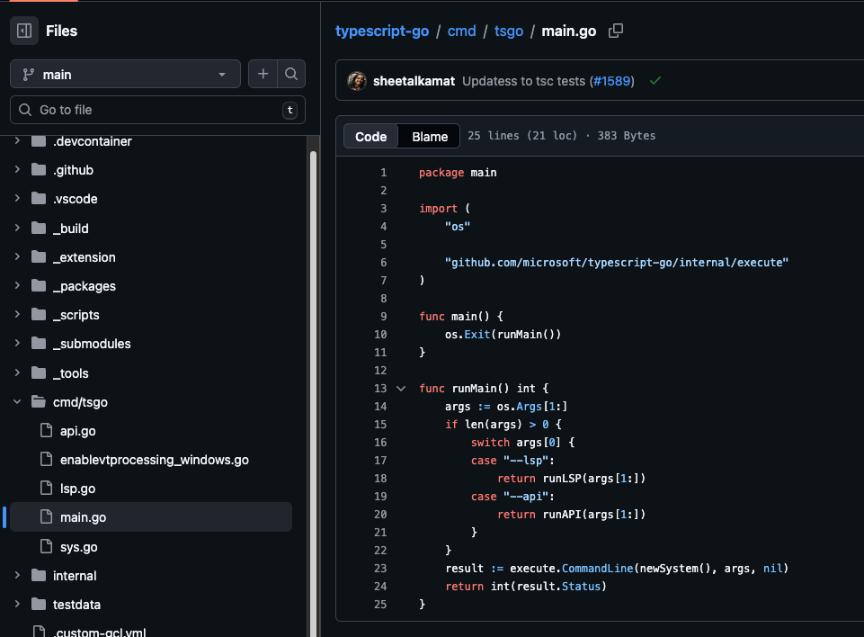

*2026-04-14*

## 《typescript-go》二次开发-项目简介

### 顶级目录

                                                          
                            
    
                                                                             
        

            ts-go vscode插件
        

        

            程序入口目录
        

        

            ts-go 所有逻辑
        

        

            测试数据
        

        

            项目配置文件
        

    
                                                                            

 

### 主入口目录

                                                          
                            
    
                                                                             
            

            api 模式启动逻辑主入口
        

        

            lsp 模式启动逻辑主入口
        

        

            程序main函数入口
        

    
                                                                            

 

### main函数分析

