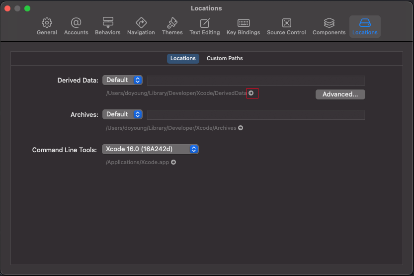
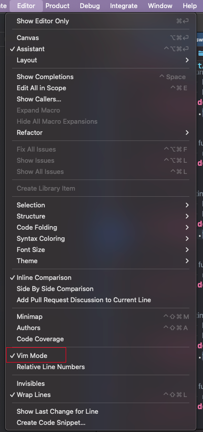
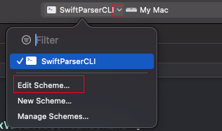
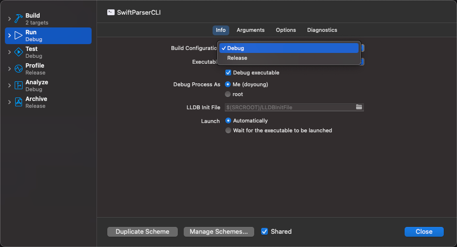
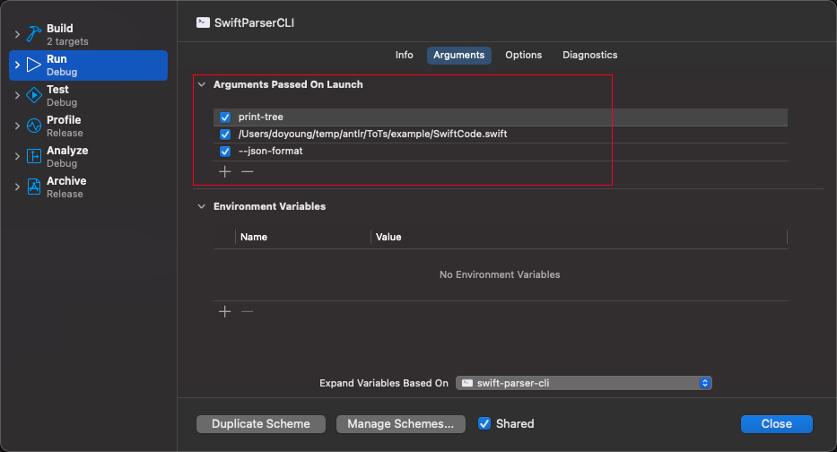

## xcode操作指南

> 2025-01-22

### xcode默认编译位置

1. 打开设置

    

2. 跳转到finder

3. 转到目录

    ```
    dir -> project -> Build -> Products -> Debug/Release
    ```
--- 
### xcode打开vim模式



---
### xcode修改项目设置



#### 修复编译类型



#### 添加命令行参数



---
### xcode调试

xcode调试时查看变量值需使用lldb调试命令，[见](Other/lldb_command.md)