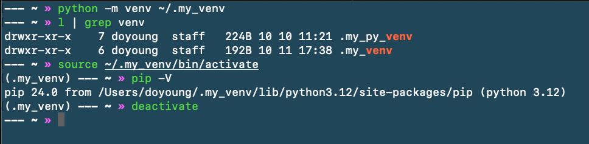

*2025-10-11*

## python创建并激活虚拟环境

1. 创建虚拟环境

  ```bash
  # 创建一个存放虚拟环境的目录（例如在用户目录下）
  python3 -m venv ~/my_venv
  ```

2. 激活虚拟环境

  ```bash
  source ~/my_venv/bin/activate
  ```

  激活后终端会显示 (my_venv) 前缀，表示当前在虚拟环境中。

3. 在虚拟环境中安装

  ```bash
  pip install xxx
  ```

4. 退出虚拟环境
  
  ```bash
  deactivate
  ```

