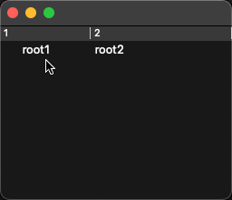
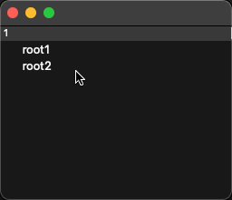

*2025-04-14*

## Qt避坑-QStandardItemModel的appendRow无法添加多行

QStandardItemModel的appendRow方法有两种重载形式：
```cpp
void appendRow(const QStandardItem *item)
void appendRow(const QList<QStandardItem *> &items)
```

如果看到第二个重载的参数是一个QList<QStandardItem *>以为可以一次性添加多行，那就错了。
此方法只能添加一行，如果参数list中包含多个元素，多余部分会添加到列中。

### 错误示例

```cpp
QTreeView* tree = new QTreeView;
QStandardItemModel* model = new QStandardItemModel();
model->appendRow(QList<QStandardItem*>() << new QStandardItem("root1") << new QStandardItem("root2"));
tree->setModel(model);
```
上面的代码只会得到以下结果



### 正确示例

想要追加多行只能一行一行的添加, 如下:
```cpp
QTreeView* tree = new QTreeView;
QStandardItemModel* model = new QStandardItemModel();
QList<QStandardItem*> list = QList<QStandardItem*>()<< new QStandardItem("root1") << new QStandardItem("root2");
for(auto item : list)
{
    model->appendRow(item);
}
tree->setModel(model);
```
