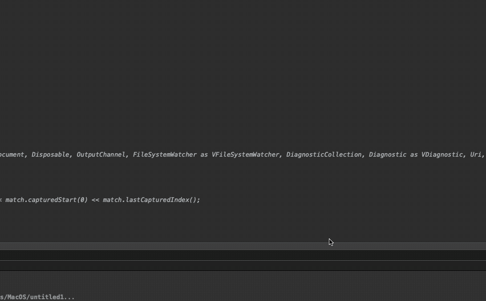
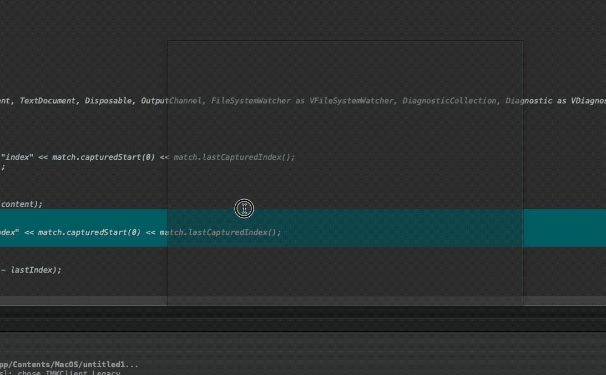

*2025-05-09*

## Qt避坑-Qt设置非透明窗口鼠标穿透效果

### 效果1



### 错误实现
```cpp
QWidget w;
w.setWindowFlag(Qt::FramelessWindowHint, true);
w.setAttribute(Qt::WA_TransparentForMouseEvents, true);
w.setWindowOpacity(0.5);
w.show();
```
### 正确实现
```cpp
QWidget w;
// 需要先设置鼠标穿透，再设置窗口无frame边框，否则鼠标穿透就不生效
w.setAttribute(Qt::WA_TransparentForMouseEvents, true);
w.setWindowFlag(Qt::FramelessWindowHint, true);
w.setWindowOpacity(0.5);
w.show();
```

### 效果2



### 错误实现
```cpp
QWidget w;
// 设置了ToolTip之后，就无需设置FramelessWindowHint了，
// w.setWindowFlag(Qt::FramelessWindowHint, true);
w.setWindowFlag(Qt::ToolTip, true);
w.setAttribute(Qt::WA_TransparentForMouseEvents, true);
w.setWindowOpacity(0.5);
w.show();
```

### 正确实现
```cpp
QWidget w;
// 同上也是需要先设置鼠标穿透，否则鼠标穿透就不生效
w.setAttribute(Qt::WA_TransparentForMouseEvents, true);
w.setWindowFlag(Qt::ToolTip, true);
w.setWindowOpacity(0.5);
w.show();
```