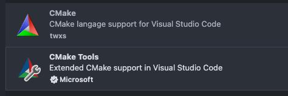
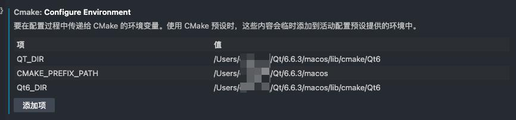
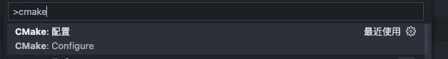
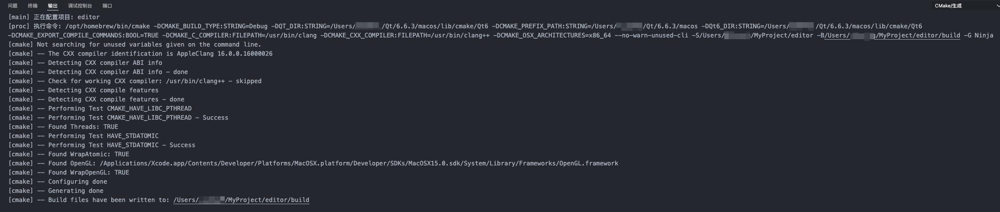

# vscode搭建Qt6 + cmake开发环境

> 2024-12-17

## 依赖

- Qt6 在线安装器 [清华镜像下载](https://mirrors.tuna.tsinghua.edu.cn/qt/archive/online_installers/)

- ninja ...

- cmake ...

- cmake vscode插件

   

## 安装

- Qt6

   使用命令行打开安装器,并使用阿里去镜像源：
   
   ```shell
   $ ./Applications/qt-online-installer-macOS-x64-4.8.1.app/Contents/MacOS/qt-online-installer-macOS-x64-4.8.1 --mirror https://mirrors.aliyun.com/qt
   ```
   
   安装全选择构建工具ninja(默认是勾选的)

## 配置

- 插件：CMake Tool 配置

1. cmake可执行文件路径

   
   
2. cmake环境变量
   
   
   
3. 配置到项目
   
   按快捷键 cmd+shift+p -> 输入 cmake -> 找到 cmake:配置 -> 执行
   
   
   
   显示下面信息就成功了
   
   
   
## 验证

```shell
   $ cd build

   $ cmake ..

   $ ninja

   $ ./src/editor
```